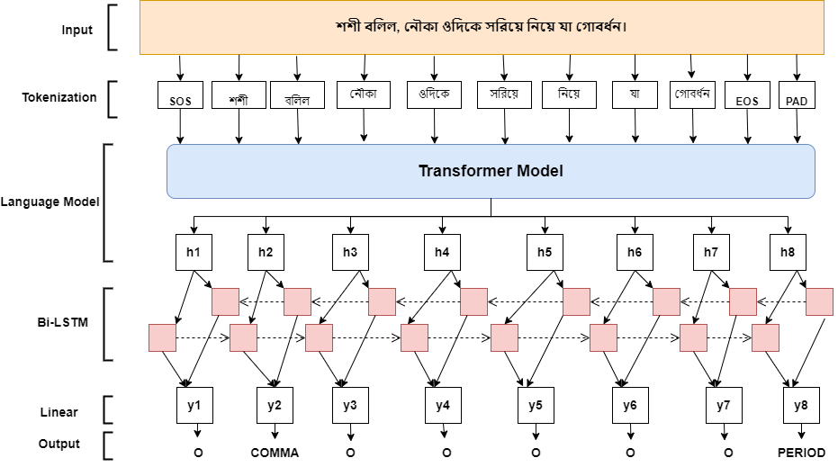

# Punctuation Restoration using Transformer Models

Punctuation-Prediction-in-Bangla-language-using-Transformer-Models

## Data

Bangla datasets are provided in `data/bn` directory.

## Model Architecture

We fine-tune a Transformer architecture based language model (e.g., BERT) for the punctuation restoration task.
Transformer encoder is followed by a bidirectional LSTM and linear layer that predicts target punctuation token at
each sequence position.


## Dependencies

Install PyTorch following instructions from [PyTorch website](https://pytorch.org/get-started/locally/). Remaining
dependencies can be installed with the following command

```bash
pip install -r requirements.txt

```

## Training

To train for Bangla the corresponding command is

```
! python src/train.py --cuda=True --pretrained-model=xlm-roberta-base --freeze-bert=False --lstm-dim=-1 --language=bangla --seed=1 --lr=5e-6 --epoch=3 --use-crf=False --augment-type=all  --augment-rate=0.15 --alpha-sub=0.4 --alpha-del=0.4 --data-path=data --save-path=out
```

#### Supported models for Bangla

```
bert-base-multilingual-cased
bert-base-multilingual-uncased
xlm-mlm-100-1280
distilbert-base-multilingual-cased
xlm-roberta-base
xlm-roberta-large
```

## Pretrained Models

XLM-RoBERTa-large model with augmentation for Bangla can be found [here](https://drive.google.com/file/d/1X2udyT1XYrmCNvWtFpT_6jrWsQejGCBW/view?usp=sharing)

## Inference

You can run inference on unprocessed text file to produce punctuated text using `inference` module. Note that if the
text already contains punctuation they are removed before inference.

Example script for Bangla

```bash
! python src/inference.py --pretrained-model=xlm-roberta-base --weight-path=out/weights.pt --language=bn  --in-file=data/test_bn.txt --out-file=data/test_bn_out.txt
```

The expected output is

```text
বিংশ শতাব্দীর বাংলা মননে কাজী নজরুল ইসলামের মর্যাদা ও গুরুত্ব অপরিসীম। একাধারে কবি, সাহিত্যিক, সংগীতজ্ঞ, সাংবাদিক, সম্পাদক, রাজনীতিবিদ এবং সৈনিক হিসেবে অন্যায় ও অবিচারের বিরুদ্ধে নজরুল সর্বদাই ছিলেন সোচ্চার। তার কবিতা ও গানে এই মনোভাবই প্রতিফলিত হয়েছে। অগ্নিবীণা হাতে তার প্রবেশ, ধূমকেতুর মতো তার প্রকাশ। যেমন লেখাতে বিদ্রোহী, তেমনই জীবনে কাজেই "বিদ্রোহী কবি"। তার জন্ম ও মৃত্যুবার্ষিকী বিশেষ মর্যাদার সঙ্গে উভয় বাংলাতে প্রতি বৎসর উদযাপিত হয়ে থাকে।
```

Please note that _Comma_ includes commas, colons and dashes, _Period_ includes full stops, exclamation marks
and semicolons and _Question_ is just question marks.

## Test

Trained models can be tested on processed data using `test` module to prepare result.

For example, to test the best preforming Bangla model run following command

```bash
! python src/test.py --pretrained-model=xlm-roberta-base --lstm-dim=-1 --use-crf=False --data-path=data/bn --weight-path=out/weights.pt --sequence-length=256 --save-path=out
```

Please provide corresponding arguments for `pretrained-model`, `lstm-dim`, `use-crf` that were used during training the
model. This will run test for all data available in `data-path` directory.

## Cite this work

```
@inproceedings{,
    title = "Punctuation-Prediction-in-Bangla-language-using-Transformer-Models",
    author = "Nahid,Raju And Shakil",
    booktitle = "",
    month = ,
    year = "",
    address = "",
    publisher = "",
    url = "",
    pages = "",
}
```
